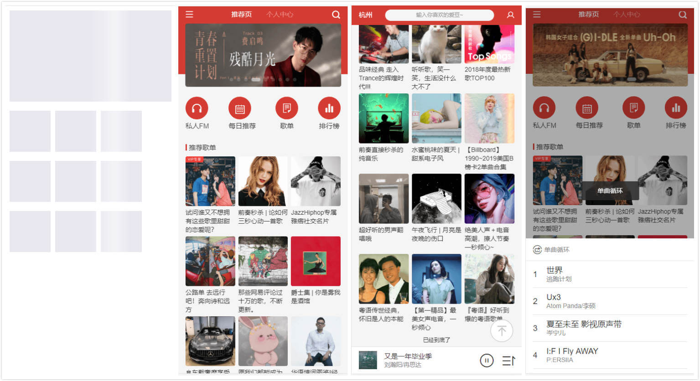
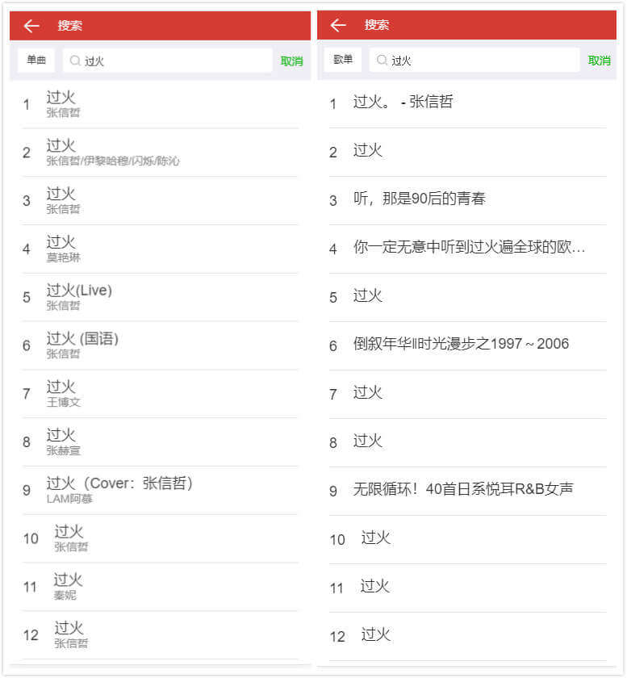
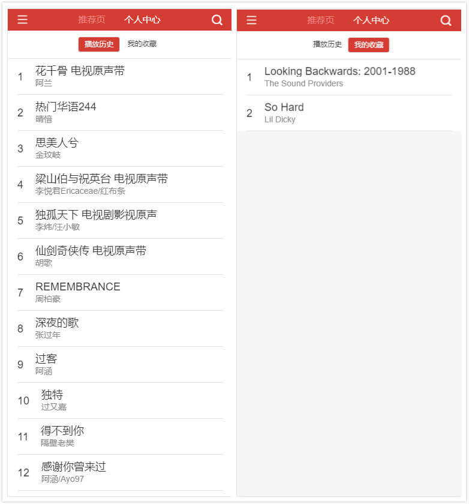
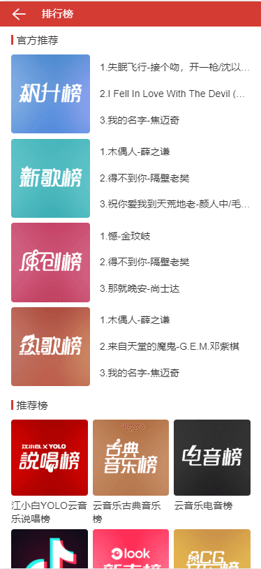

# :musical_note: vue 仿网易云音乐

> 1. :smile: 基于 vue-cli3 仿网易云音乐安卓端的 webAPP
> 2. :smile: 历时半个月完成开发，周内晚上 9 点到 11 点半，周末上午 10 点到晚上 12 点，虽然很累，但是很开心
> 3. :smile: 基本上 T 型串起来了我的所有前端技术栈，node 端没有太多涉及
> 4. :smile: 如果觉得项目对自己有帮助，写的还不错的话 :clap: :clap:，就给个 star :star: 鼓励一下吧~

## :rainbow: 声明

1. 此项目仅供自己学习，不作任何商业用途！:exclamation::exclamation::exclamation:

## :rainbow: 技术栈

1. `vue-cli3`、`vue`、`vuex`、`vue-router` - vue 全家桶
2. [better-scroll](https://ustbhuangyi.github.io/better-scroll/doc/zh-hans/) - 实现移动端页面滚动，实际工作中也用了 better-scroll，完美兼容安卓 4.3 及 ios8，可以放心使用
3. less+[vw 移动端适配](https://github.com/dirkhe1051931999/common-demo/blob/master/webpack-study-notes/step8)
4. [网易云音乐现成 node 接口](https://binaryify.github.io/NeteaseCloudMusicApi/#/?id=%E6%8E%A8%E8%8D%90%E6%AD%8C%E5%8D%95) - 后端接口，十分感谢[Binaryify](https://github.com/Binaryify)提供这么好的接口
5. [fastclick](https://github.com/ftlabs/fastclick) - 解决 300ms 延迟问题
6. [lazyload](https://github.com/verlok/lazyload) - 解决图片懒加载
7. [sprint](https://github.com/bendc/sprint) - 获取全局的的 dom，比如迷你播放器，组件内采用 ref 配合原生获取
8. [ydui](http://vue.ydui.org/) - 项目的 UI 框架
9. [create-keyframe-animation](https://github.com/HenrikJoreteg/create-keyframe-animation/stargazers) - 处理 css3 动画
10. [moment](https://github.com/moment/moment/stargazers) - 处理时间
11. [vue-server-renderer](https://www.npmjs.com/package/vue-server-renderer) - 生成骨架屏
12. [axios](https://github.com/axios/axios) - 请求接口
13. ES6/7/8 语法：解构、async/await、Promise
14. localStorage - 存储收藏的歌曲和历史播放歌曲

## :rainbow: 项目结构

```txt
├─build
│  └─skeleton # 骨架屏的一些配置文件
├─public # 静态文件夹
├─screenshot # 截图
├─server # 服务端，来源网易云音乐现成 node 接口，完全复制过来的
└─src
    ├─api # 接口
    │  └─restfulApi 
    ├─common
    │  ├─fonts # 图标
    │  ├─images # 图片
    │  ├─mixins # mixins
    │  ├─scripts # 页面依赖的js脚本
    │  └─styles # 样式文件，css初始化，变量定义等
    ├─components
    │  ├─bubble # 下拉刷新的css3气泡动画，可以不用看
    │  ├─carousel # 轮播图
    │  ├─loading # loading组件
    │  ├─musiclist # 音乐列表
    │  ├─navBar # 首页顶部的bar
    │  ├─palace # 首页的宫格
    │  ├─progressbar # 播放器内核的进度条
    │  ├─scroll # 封装后better-scroll组件，可以以slot形式使用，来实现页面滚动
    │  ├─skeleton # 骨架屏组件，可以自定义样式
    │  │  ├─basic
    │  │  └─layout
    │  ├─songlist # 歌单列表组件，推荐歌单和官方推荐共用的样式组件
    │  └─titleBar # 首页的状态栏，用于切换个人中心与推荐页
    ├─config # 一些配置参数
    ├─router # 路由文件
    ├─store # vuex
    └─views
        ├─playlistPage # 歌单列表
        ├─playPage # 播放器内核
        ├─recommendPage # 推荐页
        ├─searchPage # 搜索页
        └─userCenterPage # 个人中心
```

### :rainbow: 执行

> 记着先 `npm install`服务端和客户端

```js
{
  "scriptInfo": {
    "netserver": "开启后端服务",
    "serve": "开启前端服务",
    "build": "生产环境执行构建",
    "skeleton": "生成骨架屏"
  },
  "scripts": {
    "netserver": "node ./server/app.js",
    "serve": "vue-cli-service serve",
    "build": "vue-cli-service build",
    "skeleton": "node ./build/skeleton/skeleton.server.js && node ./build/skeleton/skeleton.client.js "
  },
}
```

## :rainbow: 实现功能

1. 骨架屏
2. 推荐页
3. 个人中心-播放历史
4. 个人中心-我的收藏
5. 搜索页
6. 歌单详情页
7. 播放器内核-全屏播放器
8. 播放器内核-迷你播放器
9. 播放器内核-播放模式（随机、顺序，单曲）、前进/后退、收藏/取消收藏、播放/暂停
10. ...

## :rainbow: TODO

1. 增加私人 FM、每日推荐、歌单页
2. 增加歌手列表
3. 增加歌曲评论
4. ~~播放器内核-歌词~~
5. ...

## :rainbow: 实现效果

> 为了快速加载出图片，我压缩了图片，应该可以看清楚

### :paw_prints: 首页

;

### :paw_prints: 播放器内核、歌单详情

;

### :paw_prints: 搜索页

;

### :paw_prints: 个人中心

;

### :paw_prints: 推荐列表

;

## :rainbow: 进度

- :alarm_clock: 2019-06-16 完成

1. 环境/项目搭建
2. vw 方案
3. 引入 font/css/css 变量/css 格式化
4. 推荐页
5. 排行榜
6. better-scroll 的封装

- :alarm_clock: 2019-06-22 完成

1. 播放列表
2. 优化了页面路由结构
3. 数据兜底处理

- :alarm_clock: 2019-06-23 完成

1. 全屏播放页面、拖拽进度条，以及全屏展开的时的动画
2. vuex 的初始化工作
3. 格式化歌单列表
4. 页面的 loading 效果
5. 获取歌词接口挂掉了，暂时没写歌单
6. 计划删除路由的出入场动画，感觉比较鸡肋
7. 歌单详情页

- :alarm_clock: 2019-06-29 完成

1. 迷你/全屏播放器的联调
2. 上下切换歌曲
3. 播放状态、播放历史、播放列表、播放模式等需要全局访问的状态，集中在 vuex 中管理
4. 播放器切换之间的动画

- :alarm_clock: 2019-06-30 完成

1. 修复了链接不合法导致播放异常的问题
2. 修复了播放器切换之间的 bug
3. 把播放器内核组件放在了 App.vue 中，可以在 App.vue 下所有路由页都可以访问到播放器内核组件
4. 个人中心、搜索页、播放历史、我的收藏、播放列表，侧边栏等页面
5. 骨架屏的注入
6. webpack 优化
7. 迷你播放器时适配页面底部

## :rainbow: 碰见的问题

1. better-scroll 页面如何滚动
   > 子元素的 content 内容超过了父容器高度，页面就可以滚动，代码层面，假如当父容器是一个 fixed 定位元素，子元素是一个定位/非定位元素，那么子元素超出富容器高度，那么页面就能滚动。如果子元素的高度是动态增加或减小的，需要在变化的同时手动触发容器 refresh。我已经封装好了 better-scroll，包含下拉刷新和上拉加载。封装好的组件的位置`components/scroll/scroll.vue`，如何使用请看`views/recommendPage/rank.vue`。[better-scroll 文档](https://ustbhuangyi.github.io/better-scroll/doc/zh-hans/#better-scroll%20%E6%98%AF%E4%BB%80%E4%B9%88)
2. 播放器内核如何切换歌曲
   > 因为网易云音乐的歌曲链接不像 qq 音乐那样好找规律，每一个歌曲都是一个接口请求。按照黄轶的方法：提前格式化歌曲链接，切换歌曲实际上获取的是提前定义好的数据，而不是请求接口的数据。这个方法貌似在我的项目中不适用，那么问题来了，歌曲链接是请求接口的如实现上一曲和下一曲了，其实很简单，播放器组件当 create 的时候请求一次接口，之后的切换，监听 url 变化，如果 url 变了，就代代表切换歌曲了，如果链接合法，就播放歌曲。网易云音乐歌曲链接接口：`/song/url?id=33894312`
3. 播放器内核放在哪块
   > 播放器内核如果是一个路由文件的话，在全屏与迷你播放器之前切换，都会重新加载组件，重新加载一次，就会初始化一次，显然这样不合理，所以把播放器内核组件`views/playPage/play.vue`放到`App.vue`全局下，所有页面都可以访问到播放器内核。
4. 如何适配页面高度
   > 当全屏播放器切换到迷你播放器时，迷你播放器时 fixed 的，所以 window 高度会被占用一部分，这部分需要在监听 vuex 中的 fullScreen state，当为 false 的时候，并且迷你播放器高度存在，就适配下高度。避免滑不到底部
5. vuex 播放列表的管理

   > 每次打开歌单详情或者音乐列表页，都要`selectPlay`，存储播放列表，核心代码

   ```js
   // src/store/action.js
   export const selectPlay = function({ commit, state }, { list, index }) {
     // 暴力打断引用关系
     list = JSON.parse(JSON.stringify(list));
     // 先设置播放列表
     commit(types.SET_SEQUENCE_LIST, list);
     // 如果是随机
     if (state.mode == playMode.random) {
       // 那么就打乱数组
       let randomList = shuffle(list);
       // 设置当前播放列表：随机，顺序
       commit(types.SET_PLAYLIST, randomList);
       // 获取当前歌曲的索引
       index = findIndex(randomList, list[index]);
     } else {
       // 如果不是随机
       commit(types.SET_PLAYLIST, list);
     }
     // 设置当前播放可取的索引
     commit(types.SET_CURRENT_INDEX, index);
     // 设置是否全屏
     commit(types.SET_FULL_SCREEN, true);
     // 设置播放状态
     commit(types.SET_PLAYING_STATE, true);
   };
   ```

6. 骨架屏的应用
   > 项目中的骨架屏是 ssr 注入的，可以自定义样式，与常见写成一个 base64 的实现有点区别。可以看我之前写的一个 demo[vue-cli3 中使用骨架屏](https://github.com/dirkhe1051931999/common-demo/tree/master/vue-skeleton)
7. \$listeners 事件回传
   > \$listeners 包含了子组件所有的监听器，来实现事件回传。自定义事件的本质：子组件收集了父组件传入的 listener，也就是自定义事件回调，在$emit 的时候执行这个回调，并且可以传入相应的参数。之前有写过[\$listener 与 vue 自定义事件的联系](https://github.com/dirkhe1051931999/hjBlog/blob/master/blog-vue/lessons/14.md)和[源码分析 vue 的 DOM 事件和自定义事件](https://github.com/dirkhe1051931999/hjBlog/blob/master/blog-vue-sourcecode-study/lessons/30.md)，这两篇文章有助于理解\$listeners
8. icon 采用 woff
   > 页面上的所有 icon 是用了 woff 文件`common/fonts/font.woff`
9. 单曲歌词如何解析
   > 接口返回的歌词不是理想的歌词格式，需要进行二次解析与整合，我写了一个解析歌词的 demo:[网易云歌词解析](https://github.com/dirkhe1051931999/hjBlog/blob/master/blog-JavaScript/lessons/26.md)
10. webpack 优化
    > webpack 优化一直是项目中的重点，优化有很多方向：减少代码体积、chunk 和加快构建速度。减少代码体积可以是 tree shaking、scope hosting 和开启 gz，前两者是 webpack4 在生产环境自带的优化功能；加快构建速度可以使用动态链路库 dll。之前有脱离 vue-cli 从基础到深入的使用了 webpack，每一个点都有对应的 demo，并且分析并解决了开启 tree shaking 后会存在的问题。地址：[webpack 深入到进阶](https://github.com/dirkhe1051931999/common-demo/blob/master/webpack-study-notes/readme.md#1)

## :rainbow: 参考

1. 借鉴了[黄轶](https://github.com/ustbhuangyi)的[Vue2.0 开发企业级移动端音乐 Web App](https://coding.imooc.com/class/107.html)中全屏播放器和 mini 播放器的实现思路
